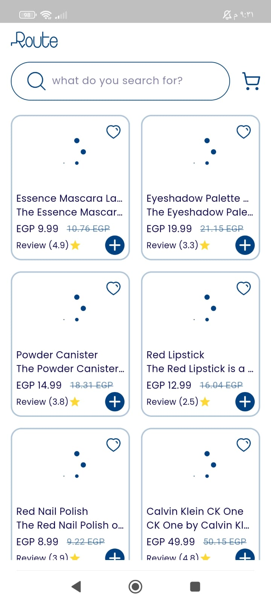
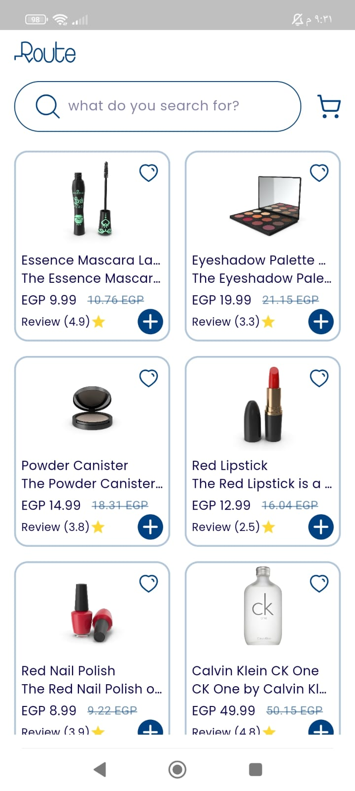
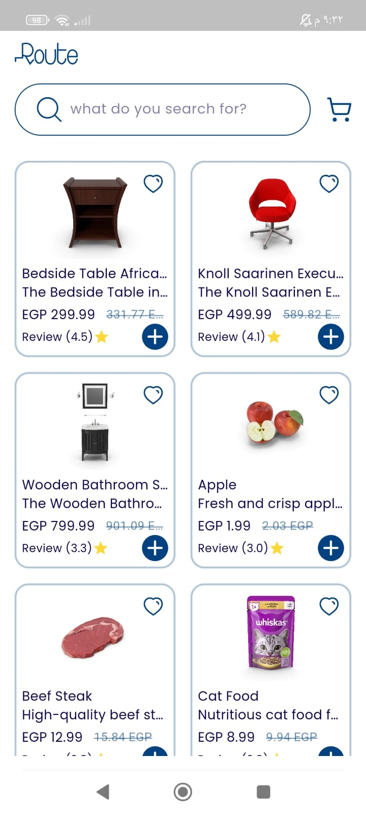
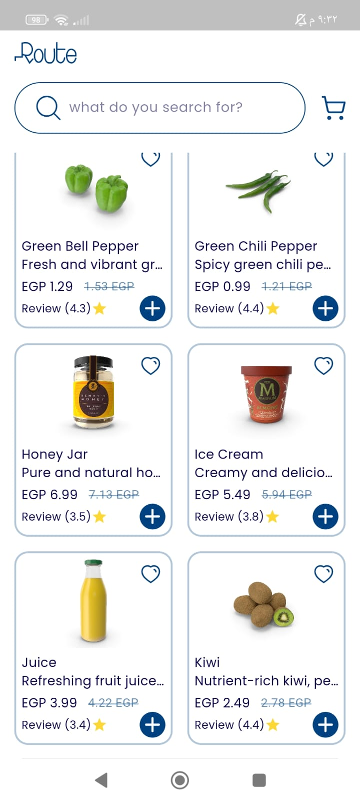

# route_task

Welcome to my repo , This is an online store that displays various products, such as food, clothes,
and other things, and allows the user to view the products and know their prices to determine
exactly what he needs.

## Application Design

 
  

## How It Done?

This application was built using Clean Architecture pattern and Bloc state management.

in this application i used:

### Dio package :

to call and handle HTTP requests

### Dio Interceptors :

it allow me to intercept requests, responses, and errors before they are handled
by then or catchError , i used it to print the request , response and error details to see the log
of calling Api.

### BLoc/Cubit state management :

I used Cubit as my view model to separates logic from the Ui .. it holds data and handle my logic of
fetching data.

in this case, I'm fetching data from Api (List of products) ,
so I created a ProductsCubit class that extends from Cubit and give it generic type of its states,
(Loading - Error - Success) and emit the state for each case while
calling Api,
in my Ui screen ..
I used BlocBuilder to rebuild the Ui according to current state.
in loading state (while calling api) I used animation loading to give the user
good experience with waiting and does not find it boring.
in Error state (when calling api failed) , i display a message that there is an Error.
in Success state (when data successfully fetched) , I display the list of products that comes from
Api.

### Clean Architecture :

I used Clean Architecture for many reasons:
1- Modularity and Maintainability that I can add features without affect on functionality of other
features.
2- Testability that I can test every single class and track the errors.
3- Can add any new feature without need to modify in existing code. (Open-Closed Principle)
4- Security reasons.
5- Clean Architecture helps in organizing the project structure in such a way that it adheres to
SOLID principles.

Clean Architecture is consists of 3 layers:

#### Data Layer:

##### DataSource

I have abstract class that called ProductsDataSource
it's the interface , it has getProducts function without implementation.
I have another class called ProductsDataSourceImp which implements from the abstract class
this class is the one that uses the getProducts function and handle it's logic,
calling the Api endpoint using Dio.

##### Models

this is the model which extends from product entity and here i'm using a named constructor to
convert the data from json object to dart object

##### ProductsRepositoryImp

this class implements from the abstract repository class , this class override the method of the
repository class to implement it and handle it's logic ,
here I'm handling the response and check its status code and handle if success or fail.

#### Domain Layer

##### Repository

this is the abstract class (interface) which has a method getProducts without implementation.

##### UseCase

this is a class which use the method of the abstract repository ,
view model or Cubit uses the method of useCase class.

##### Entity

this is a class which only initialize attributes

#### Presentation Layer

##### ViewModel (Cubit)

this is the viewModel which handle logic and hold data
it's separates logic from the Ui as mentioned above.

##### UI

this is the View which user see and interacts with it.

### Cached Network Images

I used this package to cache images that fetched from Api when it render for first time ,
so the next time user open the app it will display more smoothly and without time.

